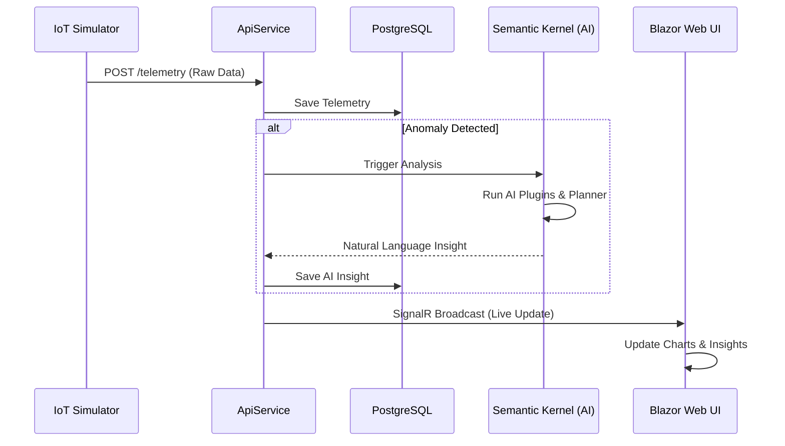
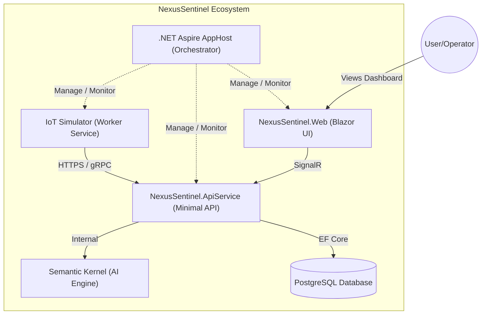
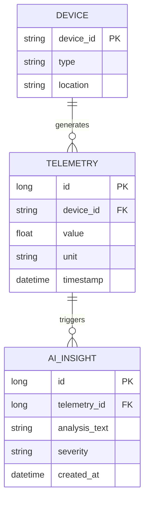
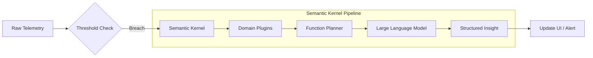

# NexusSentinel: Architecture & Concept

NexusSentinel is a cloud-native distributed system designed to demonstrate modern enterprise software patterns using .NET 9, .NET Aspire, and AI integration through Semantic Kernel.

## 🏗 High-Level Architecture

The system follows a **Microservices** approach, orchestrated by .NET Aspire to ensure seamless service discovery, observability, and local development experience.

### 1. NexusSentinel.AppHost (The Orchestrator)
The "Brain" of the distributed system. It handles:
- **Service Discovery:** Automatically connects services without hardcoded URLs.
- **Resource Management:** Orchestrates APIs, Frontends, Databases, and Messaging queues.
- **Dashboard Integration:** Provides real-time insights into logs, traces, and metrics.

### 2. NexusSentinel.ApiService (The Intelligence Engine)
The backend core responsible for data processing and AI logic:
- **IoT Data Ingestion:** Minimal APIs designed for high-throughput sensor data.
- **AI Integration (Semantic Kernel):** Acts as the AI Agent's host, processing raw telemetry into human-readable insights.
- **Domain Logic:** Validates sensor thresholds and triggers anomaly detection workflows.

### 3. NexusSentinel.Web (The Visualization Layer)
A modern **Blazor Web App** providing:
- **Real-time Monitoring:** Live telemetry charts powered by SignalR.
- **AI Feedback UI:** Displays autonomous analysis results and system health status.
- **Responsive Design:** Optimized for both control room monitors and mobile devices.

### 4. NexusSentinel.ServiceDefaults (The Foundation)
A shared library ensuring all services adhere to enterprise standards:
- **Observability:** Pre-configured OpenTelemetry for distributed tracing.
- **Resilience:** Built-in retry policies and circuit breakers.
- **Health Checks:** Standardized endpoints for container orchestration platforms (like K8s).

---

## 🚀 Key Concepts & Technologies

### .NET 9 & Aspire
Utilizing the latest .NET release to leverage performance optimizations and the revolutionary **Aspire** stack, which simplifies the complexities of cloud-native development.

### Semantic Kernel (AI Agent)
Instead of simple if-else logic for monitoring, NexusSentinel uses **Semantic Kernel** to:
- Analyze historical trends.
- Correlate different sensor metrics (e.g., Temperature vs. Fan Speed).
- Provide natural language explanations for system anomalies.

### Real-time Telemetry
Data flows from (simulated) IoT sensors to the dashboard with sub-second latency, ensuring that critical infrastructure changes are noticed immediately.

---

## 📊 System Diagrams

### 1. Real-time Data Flow (Sequence Diagram)
This diagram illustrates the end-to-end lifecycle of a sensor reading, from generation to AI analysis and UI update.

### 2. System Containers (C4 Level 2)
This diagram shows the high-level software containers and the protocols used for communication.

### 3. Data Schema (Entity Relationship Diagram)
The relationship between raw telemetry data and AI-generated insights.

### 4. AI Workflow (Semantic Kernel Pipeline)
The process of how raw data is transformed into "Intelligence" using LLM orchestration.

---

## 🛠 Tech Stack Summary

- **Language:** C# 13 / .NET 9
- **Orchestration:** .NET Aspire
- **AI Framework:** Semantic Kernel
- **Frontend:** Blazor (Interactive Server/WASM)
- **Observability:** OpenTelemetry / Prometheus / Grafana (via Aspire)
- **Database:** Entity Framework Core 9
